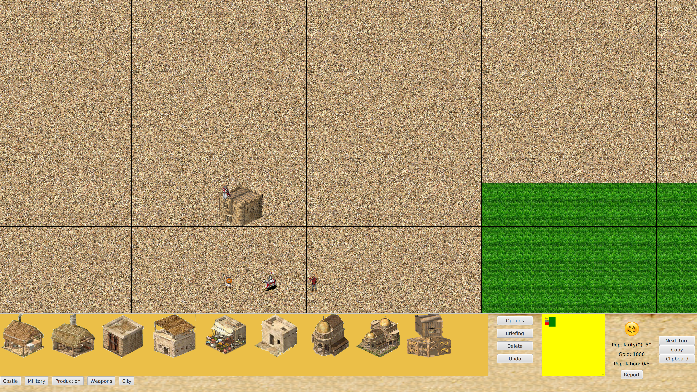
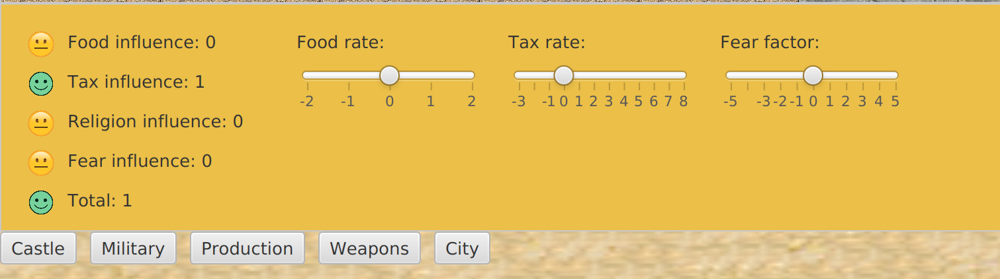
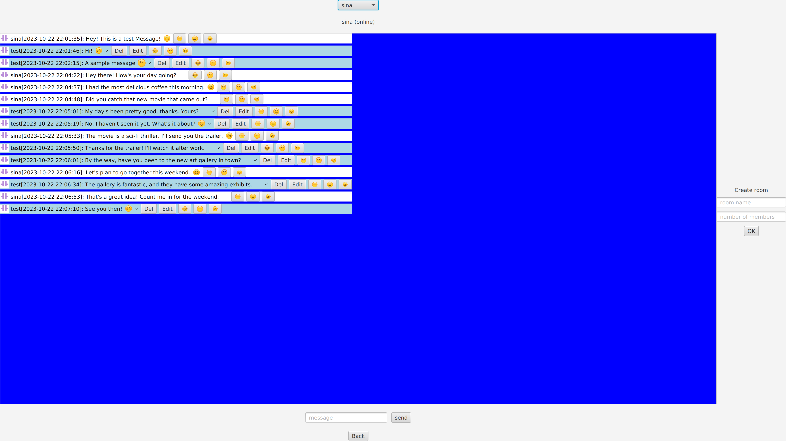
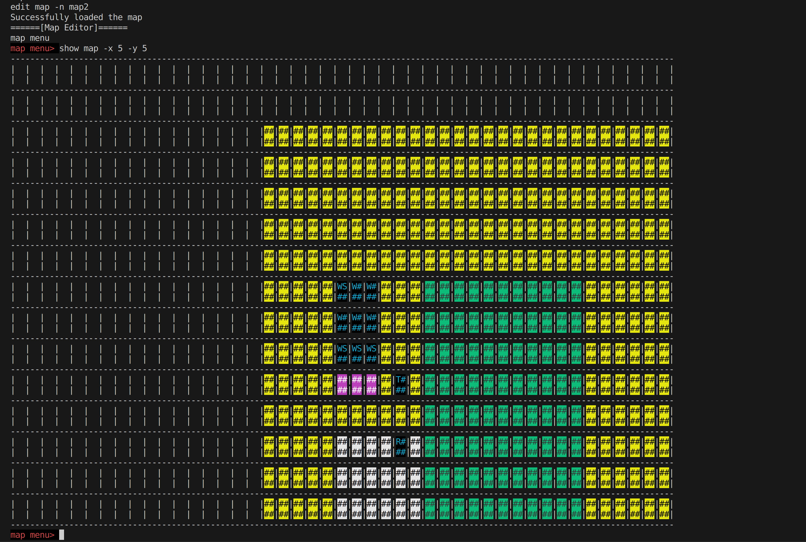

# Stronghold Crusader

**Multiplayer version (v3.0.0) [HERE](https://github.com/sinamhdv/stronghold-crusader/tree/network)**

**Graphical version (v2.0.0) [HERE](https://github.com/sinamhdv/stronghold-crusader/tree/main)**

**CLI version (v1.0.0) [HERE](https://github.com/sinamhdv/stronghold-crusader/tree/cli)**

A graphical multiplayer game developed in Java similar to the popular game Stronghold Crusader.

## [V3.0.0](https://github.com/sinamhdv/stronghold-crusader/tree/network) Features
- Turn-based multiplayer game with client/server architecture
	- Multiple clients playing with a central server managing the game
	- Synchronizing updates to the game map and status
- Using JWT for authentication
- Chat mode
	- Private/public/group chat
	- Message editing/deletion
	- Reactions
	- Showing realtime online/offline status for users
- User account database (using SQLite)
- Scoreboard

## [V2.0.0](https://github.com/sinamhdv/stronghold-crusader/tree/main) Features
- GUI for the game (See `controls.md` for an explanation of game controls)
- Maintaining CLI interface for map designer to be able to script the creation of new maps using `build_maps.sh` faster
- Profile customization menu
- Ability to copy/paste buildings on the map

## [V1.0.0](https://github.com/sinamhdv/stronghold-crusader/tree/cli) Features
- Main logic of the game developed with a CLI
	- governments, popularities, and resources
	- troop control and path-finding
	- fights
	- market, and trading resources between players
- Map management and designer to create and edit custom maps
- Advanced and robust command parsing package (`stronghold.view.parser`) to parse input commands (See `commands.md` for an explanation of commands)
- Using BFS for path-finding of troops along with a cache of previously calculated paths to speed things up

## Screenshots

*Troop Commands*

*Game Screen*

*Government Settings*

*Chat Screen*

*Market Menu*

*CLI Map*
